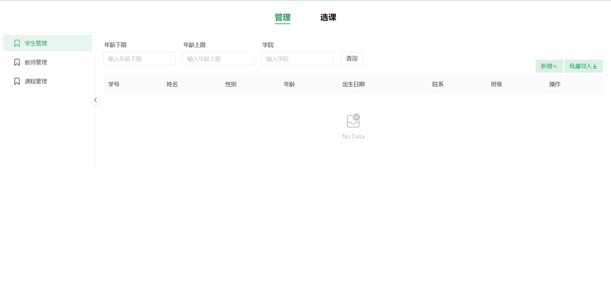

# 项目启动步骤

## 框架选取

`Vue.js` + `Navie UI` + `Spring Boot` + `Spring Data MongoDB`

## 前端配置

进入 `vue` 文件夹，打开终端，运行 `npm install`，再运行 `npm run dev`，进入弹出的网址，浏览器中出现如下页面则前端启动成功：

## 后端配置

使用 `IntelliJ IDEA` 打开 `boot` 文件夹，等 Maven 自动安装完成依赖之后，修改后端配置文件

将图中的端口和数据库名修改为本机的，如果本机 Mongo DB 还需要登录认证，还需额外配置。

启动后端。
